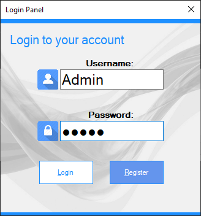
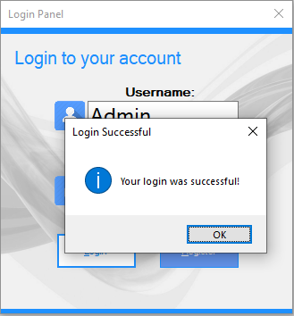
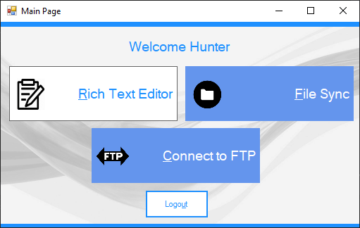

# LoginPanel - Windows Forms

A basic application made with C# and Windows forms that logs a user in using a SQL local database
with Visual Studio. This solution contains each one of the other 3 projects created for the final 
as a separate form once the user logs in.  

Made as the ***main part*** of a final project in *Fall 2016* for an introduction to desktop app development class:

* Other projects created for the final include (all created with C# Windows Forms):
  * ***NOTE***: If there are any updates to *FtpConnect*, *TextEditor*, and *FileSync*, they will be done in the according repositories. 
  * May update the repositories to include Windows 10 Universal Windows Platform controls once Xaml Islands fully releases
 
* Text Editor application written in C# and Windows Forms. 
***Link to source***: https://github.com/hjohnson12/TextEditor 

* Basic application that connects to a ftp server and does simple operations such as read contents in a directory, upload a file,
and delete a file. 
***Link to source***: https://github.com/hjohnson12/FtpConnect  

* Simple implementation of a file watcher program that watches a source directory for changes and copies the changes to the destination directory. 
***Link to source***:  https://github.com/hjohnson12/FileSync

***NOTE: Not currently being worked on, waiting on XAML Islands release for further update***

### Screenshots

##### Login Screen. Type in credentials and hit Register to register the user.

* Default Account:
  * *Username:* Admin
  * *Password:* Admin

##### Login Screen. Once user is registered or is already registered, select login and it will validate credentials

* Default Account:
  * *Username:* Admin
  * *Password:* Admin

##### Main Screen. Once logged in, you can select which form to bring up 

* These forms have their own separate repositories too. Read the beginning of README

### Prerequisites

Requires *Visual Studio 2017 or higher* to run the application.

## Built With

* C# Windows Forms
* SQL Database with Visual Studio

## Contributing

[Coming Soon]

## Authors

* **Hunter** - *Initial work* - [hjohnson012](https://github.com/hjohnson012)

See also the list of [contributors](https://github.com/hjohnson12/LoginPanel/graphs/contributors) who participated in this project.

## License

This project is licensed under the MIT License - see the [LICENSE.md](LICENSE.md) file for details
